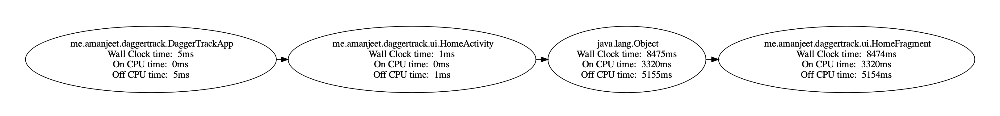

Let's say you want to track the different type of times (wall clock, on CPU and off CPU time)  for the dependency injection involved in one of your cold start flows. Following are the steps you should follow:

1. Set the `android:exported` flag to true in your `AndroidManifest.xml` for the activity you want to test.

2. Go the scripts directory in project. Run the following command to get the dependency graph involved for activity involved in cold start:

	```
	./get_injection_time.sh -p <package-name> -c <activity-component-name>
	```

	where,<br> 
	**-p** : package name of the application <br>
	**-c** : component name of activity.

	So, for the sample app the command would be,

	```
	./get_injection_time.sh -p me.amanjeet.daggertrack -c me.amanjeet.daggertrack/me.amanjeet.daggertrack.ui.HomeActivity
	```

3. This command do following things:
   * Clear the logcat
   * Kills the app if present in background or foreground
   * Launches the activity you passed and wait till it launches fully
   * Extracts the logs having the `DaggerTrack`debug filter
   * Runs a python script which is responsible for generating the graph with nodes as different components involved and their respective times.

4. For dagger track sample app following is the generated graph:



!!! Note
    The python script runs on Python3 and needs **graphviz** module to plot graphs. You can run `pip3 install -r requirements.txt` to install all dependencies.
    

